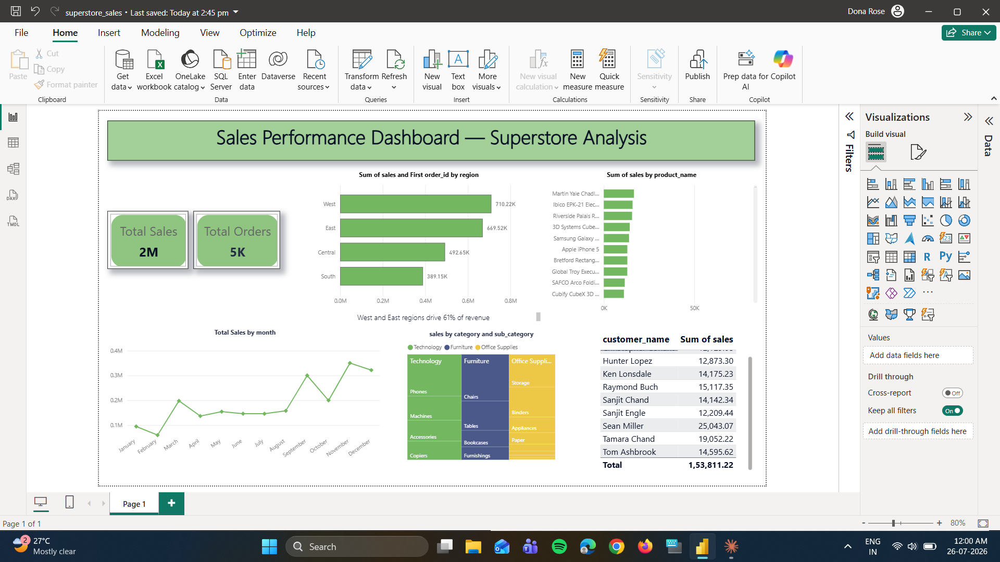

# Sales Performance Dashboard — Superstore Analysis

An end-to-end sales analytics project using SQL and Power BI to uncover revenue trends, top-performing products, and regional performance patterns from the Superstore dataset.



## Overview

This project analyzes ~9,800 retail transaction records to answer key business questions:
- Which regions and products drive the most revenue?
- How does revenue trend month-over-month?
- Who are the top customers by spend?
- How does performance break down by category and sub-category?

## Tools Used

- **MySQL** — data loading and analysis queries
- **Power BI** — interactive dashboard and visualization

## Dataset

Superstore Sales dataset (~9,800 rows), containing order details, customer information, product categories, regions, and sales figures.

## Approach

1. **Data Loading** — Loaded the raw CSV into a MySQL database (`sales_project`) using `LOAD DATA LOCAL INFILE`.
2. **Data Cleaning** — Converted text-based date fields (DD-MM-YYYY format) into proper SQL `DATE` types using `STR_TO_DATE`.
3. **SQL Analysis** — Wrote queries to extract:
   - Total revenue by region
   - Top 10 products by sales
   - Revenue by category and sub-category
   - Monthly sales trend (2015–2018)
   - Top 10 customers by revenue
4. **Dashboard Build** — Connected Power BI directly to the MySQL database and built an interactive dashboard with KPI cards, bar charts, a treemap, and a trend line.

## SQL in Action


*Example: Total revenue by region, run in MySQL Workbench.*

## Key Insights

- **West and East regions drive 61% of total revenue**, while South is the smallest contributor.
- **Phones (Technology)** is the top-performing sub-category by revenue.
- Sales show a **strong seasonal spike in November and December** each year.
- A small set of high-value customers contribute disproportionately to total revenue.

## Files in This Repository

```
├── sql/
│   └── analysis_queries.sql       # Table setup, data load, and all analysis queries
├── dashboard/
│   ├── sales_dashboard.pbix       # Power BI dashboard file
│   └── dashboard_screenshot.png   # Full dashboard screenshot
├── screenshots/
│   └── sql_query_screenshot.png   # SQL query + result example
└── README.md
```

## How to Reproduce

1. Run `sql/analysis_queries.sql` in MySQL (update the file path in the `LOAD DATA LOCAL INFILE` step to point to your local CSV)
2. Open `dashboard/sales_dashboard.pbix` in Power BI Desktop and refresh the data connection

## Author

Donna Rose
[LinkedIn](https://www.linkedin.com/in/dopymol) | [GitHub](https://github.com/dopymol)
